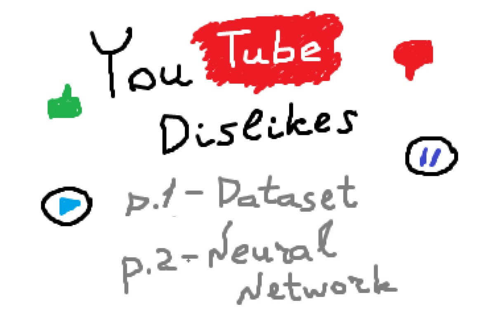

# YouTube Dislikes Dataset / Prediction

YouTube dislike prediction using Python, YouTube Data API v3, TensorFlow/Keras.



## Tutorials and Articles

1. Part 1 - Youtube Dislikes Dataset - How to collect actual YouTube data using Python and Youtube Data API v3 on [Towards Data Science](https://towardsdatascience.com/predicting-the-number-of-dislikes-on-youtube-videos-part-1-dataset-9ec431585dc3) or [GitLab](https://gitlab.com/Winston-90/youtube_dislikes/-/blob/main/article/dataset.md).
2. Part 2 - Youtube Dislikes Prediction - How to build a neural network to predict the count of dislikes on [Medium]() or [GitLab](https://gitlab.com/Winston-90/youtube_dislikes/-/blob/main/article/model.md) (coming soon).

## Project Structure

The project has the following structure:

```
youtube_dislikes
├───article
├───datasets
│   ├───youtube_custom_dataset
│   │   │   dataset_collection.ipynb
│   │   │   youtube_API_requests_examples.ipynb
│   │   │   youtube_video_id.ipynb
│   │   ├───api_keys
│   │   ├───data
│   │   └───video_IDs
│   └───youtube_kaggle_dataset
│       │   data_cleaning_kaggle.ipynb
│       │   parse_json_categories.ipynb
│       └───data  
├───embeddings
├───models
│
│   .gitignore
│   data_transformations.ipynb
│   model.ipynb
│   pretrained_word_embeddings.ipynb
│   README.md
└───requirements.txt
```

- The `article` folder contains the data for tutorials and articles.
- The `datasets` folder contains the data and notebooks for getting and cleaning the data:
  - `youtube_custom_dataset` - custom collected dataset:
    - The `api_keys` folder contains text files with YouTube API keys. To know more, visit [official documentation](https://developers.google.com/youtube/v3/quickstart/python#step_1_set_up_your_project_and_credentials).
    - The `data` folder contains data collected using YouTube Data API. To download dataset, visit [YouTube Dislikes Dataset on Kaggle](https://www.kaggle.com/dmitrynikolaev/youtube-dislikes-dataset).
    - The `video_IDs` folder contains text files with unique video IDs.
    - The `youtube_API_requests_examples.ipynb` notebook contains examples of YouTube Data API v3 requests to get information about videos and comments to explore YouTube responses structure.
    - The `youtube_video_id.ipynb` notebook contains code to get unique video IDs from kaggle dataset and/or to generate random ids.
    - The `dataset_collection.ipynb` notebook contains code to collect YouTube Dislikes Dataset.
  - `youtube_kaggle_dataset` - dataset from Kaggle:
    - The `data` folder contains [YouTube Trending Video Dataset downloaded from Kaggle](https://www.kaggle.com/rsrishav/youtube-trending-video-dataset) and clean version of it.
    - The `data_cleaning_kaggle.ipynb` notebook contains code to clean Kaggle dataset.
    - The `parse_json_categories.ipynb` notebook contains code to convert JSON categories file to python dictionary.
- The `embeddings` folder contains pretrained word embeddings downloaded from http://nlp.stanford.edu/data/glove.6B.zip or http://vectors.nlpl.eu/repository/.
- The `models` folder contains trained models and data to train them.
- The `data_transformations.ipynb` notebook contains code to read data and transform it for the model.
- The `model.ipynb` notebook contains code to create and train neural network.
- The `pretrained_word_embeddings.ipynb` notebook contains example code how to use pretrained word embeddings in TensorFlow/Keras Embedding layer.

## Setup

To run this code, you must have some libraries installed. 

You should create a virtual environment, activate it and run `pip install -r requirements.txt`. 
You can also do it with conda - create virtual environment, activate it, and run commands to install each of the libraries listed in the `requirements.txt` file.