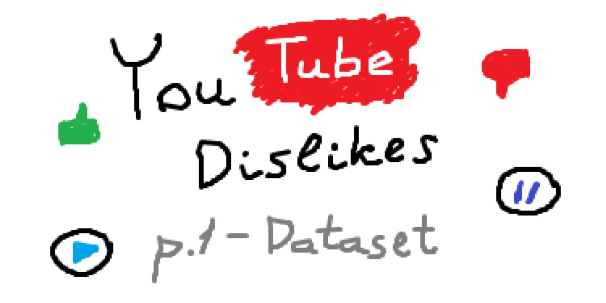
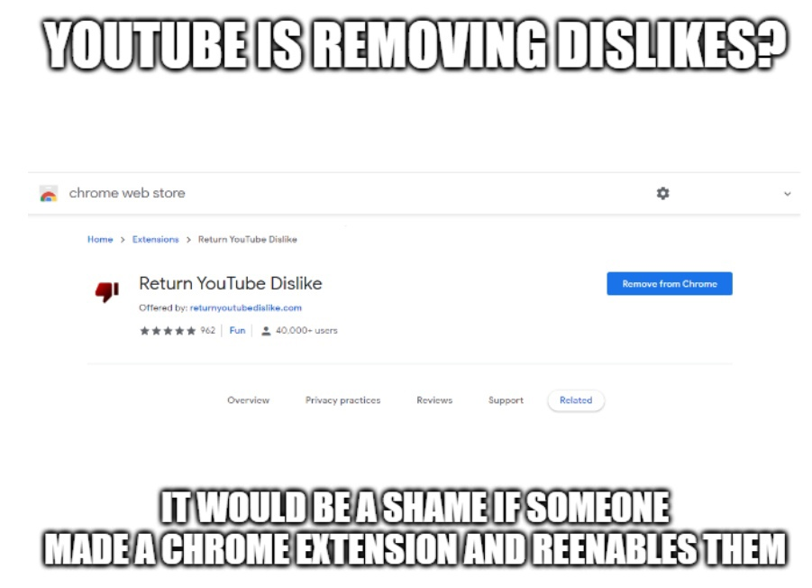
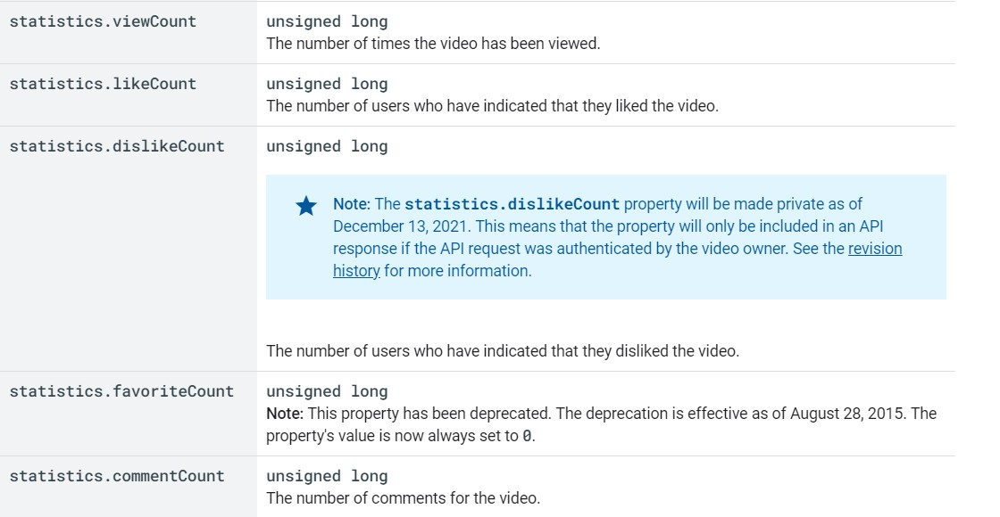
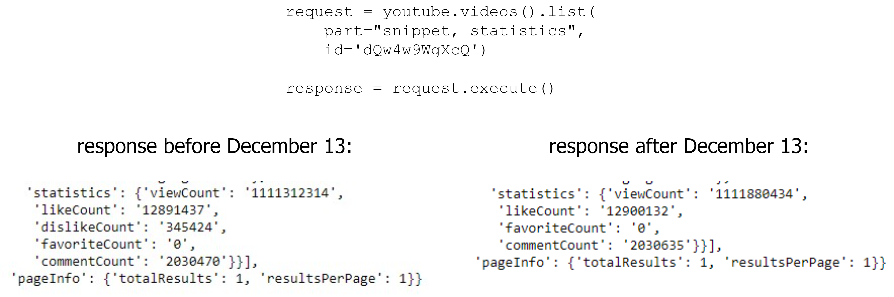
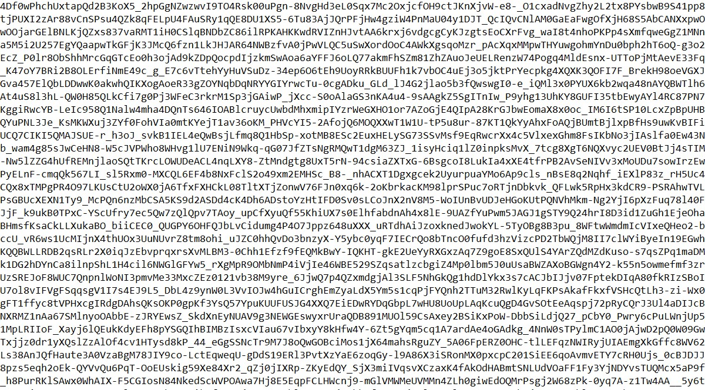
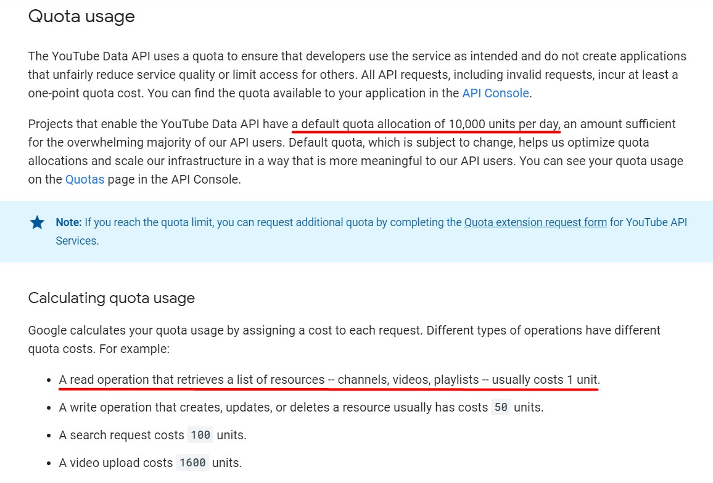
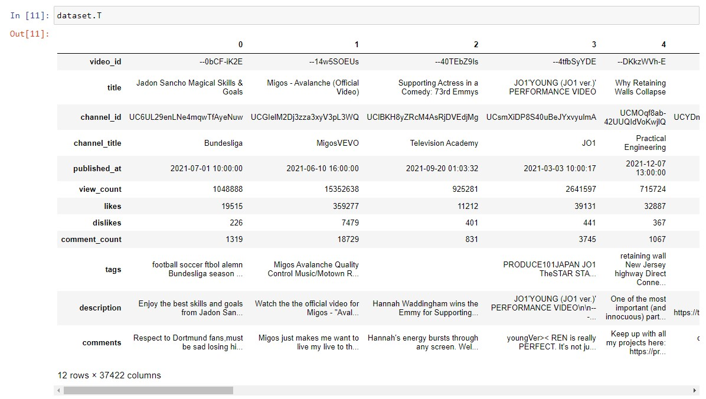
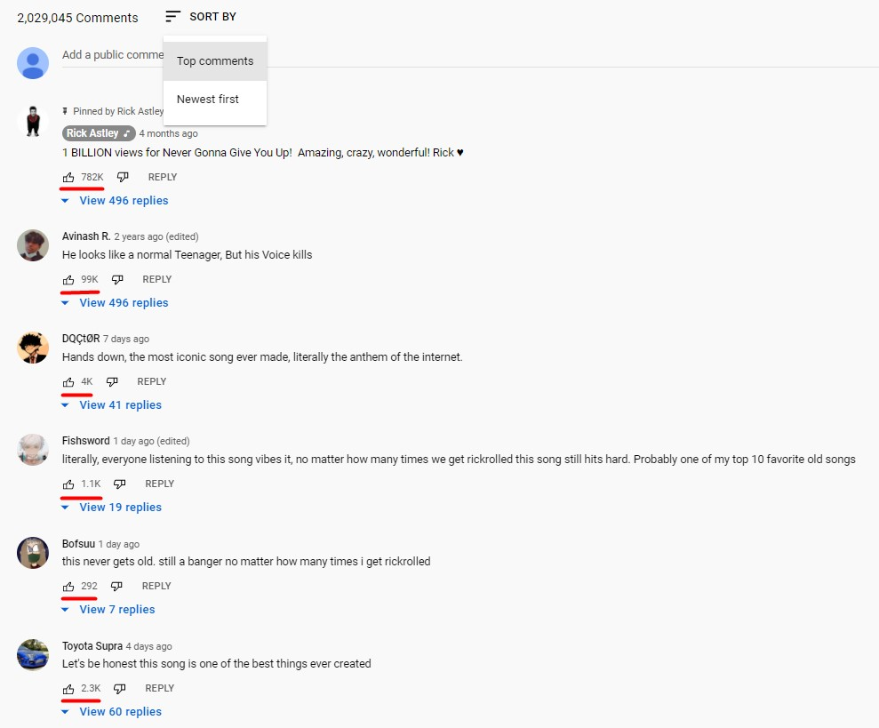

# Predicting the Number of Dislikes on YouTube Videos. Part 1 - Dataset
## How to collect topical YouTube data using Python and Youtube Data API v3

|  |
|:--:|
| <b>Preview. Image by Author</b>|

In this article, you will learn how to work with the Youtube API to get up-to-date information about videos.

This is the first part of the dislike prediction project. Here we will collect and clean data and in the second part train a model based on it.

The dataset that I have collected is available for download on [Kaggle](https://www.kaggle.com/dmitrynikolaev/youtube-dislikes-dataset). 
All the code I used is available in the [GitLab repository](https://gitlab.com/Winston-90/youtube_dislikes).

### Datasets Licenses

Note that both [YouTube Trending Video Dataset](https://www.kaggle.com/rsrishav/youtube-trending-video-dataset) and [YouTube Dislikes Dataset](https://www.kaggle.com/dmitrynikolaev/youtube-dislikes-dataset) have [CC0: Public Domain license](https://creativecommons.org/publicdomain/zero/1.0/), so you can use them for free. You can learn more about data sources and data collection methods on Kaggle.

## Introduction

As we all know, Youtube announced the decision to hide the number of dislikes from users around November 2021. This decision can be discussed as much as we want, but we have what we have - the dislike ratio is now visible only to the video creators.

Fortunately, the Internet community is rich in talents and craftsmen almost immediately created an extension to return dislikes.

|  |
|:--:|
| <b>Internet meme. [Public domain](https://ifunny.co/picture/outubets-removing-dislikess-it-would-be-a-shame-if-someoke-KuIOzIu79)</b>|

Unfortunately, `dislikeCount` property is private from December 13, 2021.

|  |
|:--:|
| <b>dislikeCount property is now private. Screenshot of a [public web page](https://developers.google.com/youtube/v3/docs/videos?hl=en)</b>|

This extension still works, **but now it can't receive official information** throw an API. Instead, the number of dislikes is counted on their own and stored in an external database. This solution partially solves the problem, but it is far from the truth and this gap will increase more and more.

Based on this, a few days before December 13 I had a funny idea - train a neural network to predict the number of dislikes. And this is the first part of this idea because, like any machine learning algorithms, neural networks require data.

## Important - It's All About The Code

The code that is given in the snippets in this article will not work correctly. Well, it will, but to get a properly working program, you need to add a lot of additional checks and exception-catching blocks.

**DO NOT COPY THE CODE FROM THE ARTICLE**. 

Its purpose is to show the simplified structure of the program and the general direction.

If you want to use the code, explore the repository below. You can also see the filename you need to explore for each code snippet.

https://gitlab.com/Winston-90/youtube_dislikes

## YouTube Trending Video Dataset from Kaggle

There is a ready-made dataset for similar tasks - [YouTube Trending Video Dataset from Kaggle](https://www.kaggle.com/rsrishav/youtube-trending-video-dataset). 

This dataset is updated daily since August 12, 2020, and receives information about 200 trending videos every day (API does not allow you to get more) for each of the following countries: India, USA, Great Britain, Germany, Canada, France, Russia, Brazil, Mexico, South Korea, and Japan. Thus, during this time, this dataset accumulated about 100 thousand records for each country ((*365 days in a year* from August 2020 to August 2021 + *120 days* from September to December) * *200 videos every day ≈ 100 000*).

Obviously, there are duplicated rows in the dataset (with the same video ID), because the video can be trending for more than one day. If we take this into account and read only unique video IDs, we will get about *200 thousand records for all countries*.

Unfortunately, the dataset does not contain information about comments, and it seems to me that they have the greatest predictive potential. In addition, information about the early rows of the dataset is not relevant, since the number of likes/dislikes has changed during this year.

Then I decided to build a similar, but relevant dataset using the Youtube Data API.

## Building Custom Dataset

### Requests Examples

We need to execute two requests, one to get information about the video, and the second- for comments.

It's not difficult at all. First, you need to [get an API key](https://developers.google.com/youtube/v3/quickstart/python#step_1_set_up_your_project_and_credentials) and install `google-api-python-client` library with pip or conda commands. Then follow official documentation for [videos().list()](https://developers.google.com/youtube/v3/docs/videos/list) and [commentThreads().list()](https://developers.google.com/youtube/v3/docs/commentThreads/list) methods.

In the code, first of all, you need to get an `googleapiclient.discovery.build` object, which will allow you to make requests. In the code below, you need to assign your API key to  `DEVELOPER_KEY` variable. To know more, visit [official documentation](https://developers.google.com/youtube/v3/quickstart/python#step_1_set_up_your_project_and_credentials) or some of the [tutorials](https://rapidapi.com/blog/how-to-get-youtube-api-key/).

```python
import googleapiclient.discovery  # API client library
# conda install -c conda-forge google-api-python-client
# pip install google-api-python-client

# API information
API_SERVICE_NAME = "youtube"
API_VERSION = "v3"
DEVELOPER_KEY = 'YOUR_API_KEY'  # something like 'aAAsaah3yf4fgsg5htfj3hb_fdudfd8ew0f-d0d'

# API client
youtube = googleapiclient.discovery.build(API_SERVICE_NAME,
                                          API_VERSION,
                                          developerKey=DEVELOPER_KEY)
```

When the `youtube` variable is successfully initialized, it remains only to formulate a request and execute it.

```python
# youtube - googleapiclient.discovery.build() object

# for a particular video
video_id = 'dQw4w9WgXcQ'

# video request
# https://developers.google.com/youtube/v3/docs/videos/list
request = youtube.videos().list(
    part="snippet, statistics",
    id=video_id)
response = request.execute()
print(response)

# comments request
# https://developers.google.com/youtube/v3/docs/commentThreads/list
request = youtube.commentThreads().list(
    part="snippet",
    maxResults=51,
    order="relevance",
    textFormat="plainText",
    videoId=video_id)
response = request.execute()
print(response)

# For more details see: 
# https://gitlab.com/Winston-90/youtube_dislikes/-/blob/main/
# datasets/youtube_custom_dataset/youtube_API_requests_examples.ipynb
```

Both requests return a python dictionary, which is easy to understand, given that the documentation describes everything in sufficient detail.

As I said before, now the `dislikeCount` property is hidden - it doesn't present in response anymore. This is an example from [youtube_API_requests_examples.ipynb notebook](https://gitlab.com/Winston-90/youtube_dislikes/-/blob/main/datasets/youtube_custom_dataset/youtube_API_requests_examples.ipynb).

|  |
|:--:|
| <b>Response for the same request before and after December 13, 2021. Image by Author</b>|

### YouTube Video IDs

As you can see, you need to specify a video ID for both requests. YouTube allows you to get information about popular (trending) videos, but only 200 per day.

YouTube video ID has a clear structure, and we can just iterate through all possible combinations. We can, right? For fun, let's do the math. YouTube video ID consists of 11 characters, each of which can be a number (0-9) a letter (a-z and A-Z), dash (-), or underscore (_). So it's 64 possible symbols total (10 numbers + 2*26 letters + 2 special characters). The number of possible IDs under such conditions is 64^11. That's how much it is - **73,786,976,294,838,206,464**. 

73 * 10^18, 73 quintillions, or to better understand, 73 billion of billions. Even if we had time for calculations (**2 million years** in case of a million operations per second), there is definitely *not enough* space on the hard disk to store so much data.

Of course, we don't need to do this. Since we have a Kaggle dataset with 200 thousand unique IDs - this should be enough.

|  |
|:--:|
| <b>YouTube video IDs. Image by Author</b>|

Since 200 thousand is too much for us as we will see later, I started with videos IDs that were trending in Canada, USA and Great Britain. There are about 31 thousand of them. They are located in the `unique_ids_GB_CA_US.txt` file.

## YouTube Data API Quota Usage Rules

Now we have a problem - quota usage. Of course, no one will allow you to make an unlimited number of requests per day - that's what the quota is for. While the read operation costs 1 unit, by default YouTube allows you to make 10,000 requests every day.

|  |
|:--:|
| <b>YouTube Data API quota usage rules. Screenshot of a [public web page](https://developers.google.com/youtube/v3/getting-started#calculating-quota-usage)</b>|

I do two requests for each video (to get statistics and comments), so ideally, I will get 5,000 entries in the dataset per day for one API key. That sounds not so bad.

But YouTube will block your access from time to time. So you can't just run a loop on 5,000 IDs and quietly leave. After I debugged the code and caught all possible exceptions (as it seems to me), I still got HTTP 403 errors (means that the server understands the request, but will not execute it) sometimes, so I had to constantly monitor the execution of the code. That's why in the code below I not only cycle by video ID but also the outer cycle by the number of tries.

So in the end, I was collecting small pieces of the dataset and then put them together.

### Execution Time

The execution time depends on many factors - hardware, Internet speed, probably the limitations of YouTube itself, and so on. The best result I got was about 6 requests per second, and the average was **2-3 requests per second**.

To collect the result dataset, I sent about 60k requests, which took **about seven hours**. Not so much, but keep in mind that this time was distributed over a few days, and required almost constant supervision.

## Putting All Together - Working Code

As far as I can tell, this code is very similar to the one the author used to collect the [YouTube Trending Video Dataset from Kaggle](https://www.kaggle.com/rsrishav/youtube-trending-video-dataset). Let me explain it out a bit.

The main function `get_video_info_by_id()` takes the video ID as a parameter and returns data about this video as a list. You can get any fields you want, you just need to explore the python dictionary that the query returns. The actual code of this function is not much more complicated, it just contains a lot of try-catch blocks to make sure fields are available.

The `request_loop()` function iterate over a list of video IDs and execute `get_video_info_by_id()` function for each ID. It accumulates information into a list of lists and saves it using [pickle library](https://docs.python.org/3/library/pickle.html).

The main program or main request loop is to run `request_loop()` several times, moving the ID list each time so as not to request information about the same video multiple times.

```python
import pickle
# youtube - googleapiclient.discovery.build() object

def get_video_info_by_id(video_id, youtube):
    """ Get information about a video using YouTube Data API v3 """

    # youtube request for information about video
    request = youtube.videos().list(
        part="snippet, statistics",
        id=video_id)
    response = request.execute()

    publishedAt = response['items'][0]['snippet']['publishedAt']
    channelId = response['items'][0]['snippet']['channelId']
    title = response['items'][0]['snippet']['title']
    description = response['items'][0]['snippet']['description']
    channelTitle = response['items'][0]['snippet']['channelTitle']
    viewCount = int(response['items'][0]['statistics']['viewCount'])
    likeCount = int(response['items'][0]['statistics']['likeCount'])
    dislikeCount = int(response['items'][0]['statistics']['dislikeCount'])
    tags_list = response['items'][0]['snippet']['tags']
    commentCount = int(response['items'][0]['statistics']['commentCount'])

    # youtube request for information about comments
    request = youtube.commentThreads().list(
        part="snippet",
        maxResults=20,
        order="relevance",
        textFormat="plainText",
        videoId=video_id)
    response = request.execute()

    comments = ' '.join([obj['snippet']['topLevelComment']['snippet']['textDisplay']
                        for obj in response['items']])

    return [video_id, title, description, channelId, channelTitle,
            publishedAt, tags, viewCount, likeCount, dislikeCount,
            commentCount, comments]


def request_loop(video_ids, filename, youtube):
    """ Iterate over video_ids and execute `get_video_info_by_id()` function """

    youtube_data = []
    total = len(video_ids)

    for counter, video_id in enumerate(video_ids):
        try:
            curr = get_video_info_by_id(video_id, youtube)
        except Exception as e:
            print("Http Error 403 due to exceeded quota")
            break

        # append all data in the list
        youtube_data.append(curr)

        print(f"{counter+1}/{total}: collect information about {video_id}")

    save_data(youtube_data, f"{filename}_{counter+1}_final.p")
    print(f'\tSaved in f"{filename}_{counter+1}_final.p"')

    return counter

# read ids collected using 'collect_unique_video_ids' function
with open('video_IDs/unique_ids_from_kaggle.txt', 'r') as f:
    ids = f.read().splitlines()

# main request loop
for i in range(5):
    # 5 tries to get data
    successful_iterations = request_loop(ids,
                                         f"data/{i+1}_youtube_data",
                                         youtube)

    # skip one more video, that raised exception
    video_ids = video_ids[successful_iterations+1:]

# DO NOT COPY THIS
# See full version on:
# https://gitlab.com/Winston-90/youtube_dislikes/-/blob/main/
# datasets/youtube_custom_dataset/dataset_collection.ipynb
```

The code above saves a list of lists to disk. To turn it into a dataset, you need to read all the saved files, convert them into a pandas DataFrame, and concatenate them all together.

```python
import pickle
import pandas as pd


def process_one_list(filename):
    """ Read 'filename' using pickle and convert list of lists to a pd.Dataframe """

    data = pickle.load(open(filename, 'rb'))
    data = list(filter(None, data))  # delete empty list elements

    df = pd.DataFrame(data, columns=['video_id', 'title', 'description', 'channelId', 'channelTitle',
                                     'publishedAt', 'tags',  'viewCount', 'likeCount', 'dislikeCount',
                                     'commentCount', 'comments'])

    return df


# list of pickle filenames
filenames = ['data/youtube_data_1.p', 'data/youtube_data_2.p']

# Convert all filenames to dataframes and concatenate them 
list_of_df = []
for filename in filenames:
    current_df = process_one_list(filename)
    list_of_df.append(current_df)

dataset = pd.concat(list_of_df)
dataset.reset_index(drop=True, inplace=True)

# DO NOT COPY THIS
# See full version on:
# https://gitlab.com/Winston-90/youtube_dislikes/-/blob/main/
# datasets/youtube_custom_dataset/dataset_collection.ipynb
```

I will not describe data cleaning in detail here, but keep in mind that it must be done. I checked the data for the uniqueness of the ID, non-English characters, and so on. To know more, explore [clean_data() function](https://gitlab.com/Winston-90/youtube_dislikes/-/blob/main/datasets/youtube_custom_dataset/dataset_collection.ipynb).

## Summary

As a result, I managed to collect about **37k records**. This is not so bad, considering that the idea came to my mind not so long ago. I am happy with the result because I have a small but topical dataset.

You can get it here - [YouTube Dislikes Dataset on Kaggle](https://www.kaggle.com/dmitrynikolaev/youtube-dislikes-dataset). It looks something like this (it is transposed only to fit all the columns on the screen):

|  |
|:--:|
| <b>Youtube Dislikes Dataset. Image by Author</b>|

During writing this code, I also wrote code to clean up the kaggle dataset (getting only unique IDs from the last request, deleting special characters, and so on). You can find the code to do this [in the repository](https://gitlab.com/Winston-90/youtube_dislikes/-/blob/main/datasets/youtube_kaggle_dataset/data_cleaning_kaggle.ipynb) or [on Kaggle](https://www.kaggle.com/dmitrynikolaev/youtube-trending-video-dataset-cleaning).

Both datasets have the same structure, so they can be used to train the same model or models with the same architecture. Here are the features:
- `video_id` - Unique video ID
- `title` - Video title
- `channel_id` - Channel ID
- `channel_title` - Channel title
- `published_at` - Video publication date
- `view_count` - Number of views
- `likes` - Number  of likes
- `dislikes` - Number  of dislikes
- `comment_count` - Number of comments
- `tags` - Video tags as one string
- `description` - Video description
- `comments` - 20 video comments as one string

All text fields contain only ASCII and Latin characters (numbers, English letters and punctuation marks). If there are no letters left in the string after deleting these characters, this row is deleted from the dataset. This applies to `title` and `channel_title` (for example `"伟大的视频!!!!"` -> `"!!!!"` will be deleted).

### About the Comments

It is worth saying that it is logical to use the most popular comments for prediction. But the YouTube API does not allow you to get them. The `relevance` parameter in the request is ignored when setting the `video_id`, as [described in the documentation](https://developers.google.com/youtube/v3/docs/commentThreads/list). 

It will not be possible to get the most popular comments even by parsing because even YouTube itself shows them on the page in an unsorted order. If you know how to solve this problem, please contact me or write a comment.

So in fact it's just those 20 comments that YouTube decided to send. But it's better than nothing, right?

|  |
|:--:|
| <b>Top YouTube comments are unordered. Screenshot of a [public web page](https://www.youtube.com/watch?v=dQw4w9WgXcQ)</b>|

Since Kaggle YouTube Trending videos dataset does not contain the `comments` field, this value is equal to a space (" ") for the entire dataset.

## Conclusion

To write this article, I wrote and executed the code that allowed me to get:
1. The clean version of the [YouTube Trending Videos Dataset](https://www.kaggle.com/rsrishav/youtube-trending-video-dataset) of 137k rows. This dataset contains information about trending YouTube videos from August 2020 to December 2021 for 11 counties, but with Latin video titles and channel titles.
2. The custom collected [YouTube Dislikes Dataset](https://www.kaggle.com/dmitrynikolaev/youtube-dislikes-dataset) of 37k rows. This dataset contains information about dislikes for 37k videos, that were trending in the USA, Canada, and Great Britain in the same time period. Information was collected just before December 13, which makes this dataset **the most relevant dislikes dataset**. Unfortunately, **it is impossible to get a new version** of such a dataset.

Now I plan to train a neural network on these datasets to predict the number of dislikes on the video. Follow me so as not to miss it!
