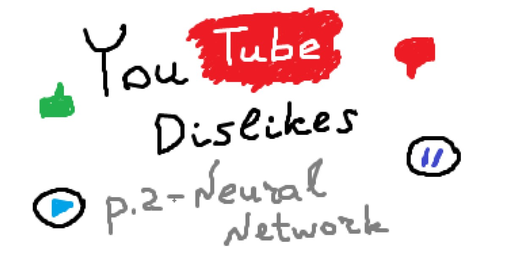
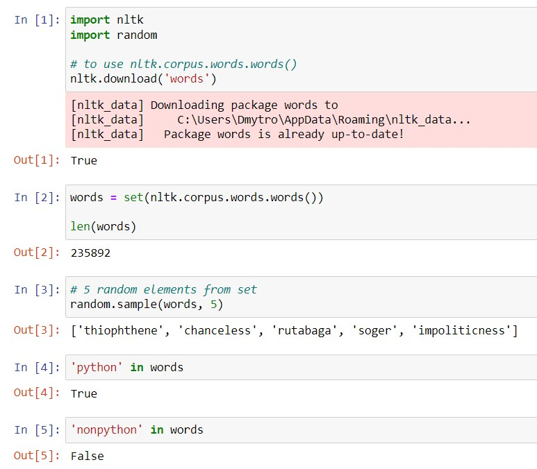
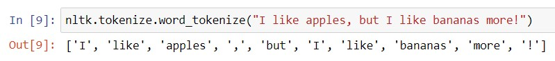
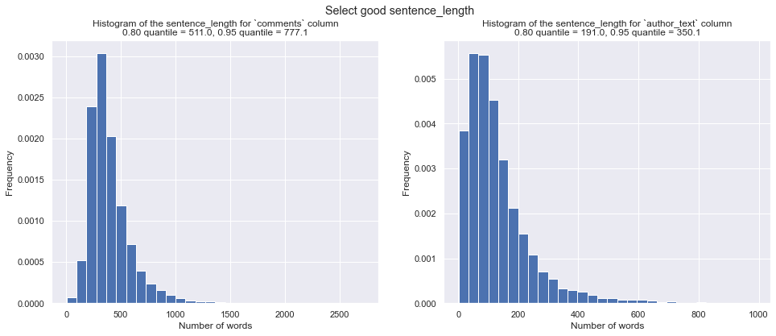
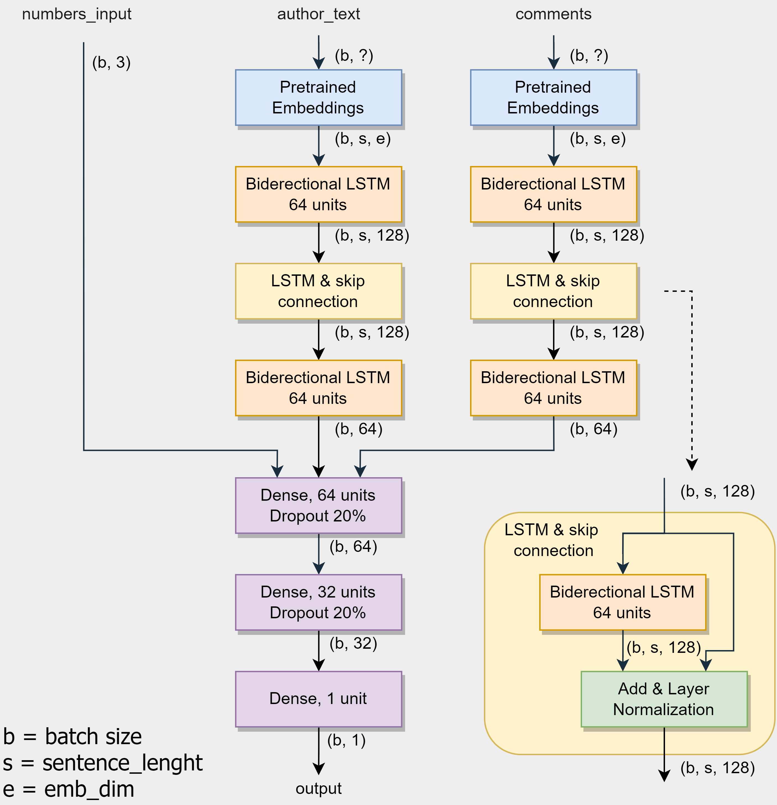
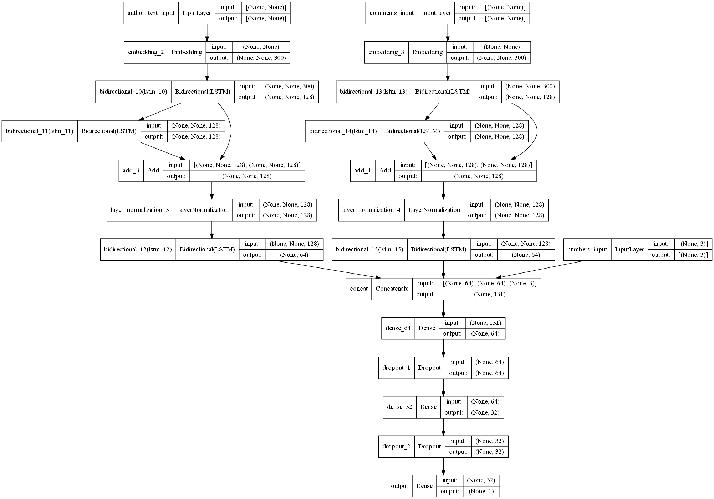
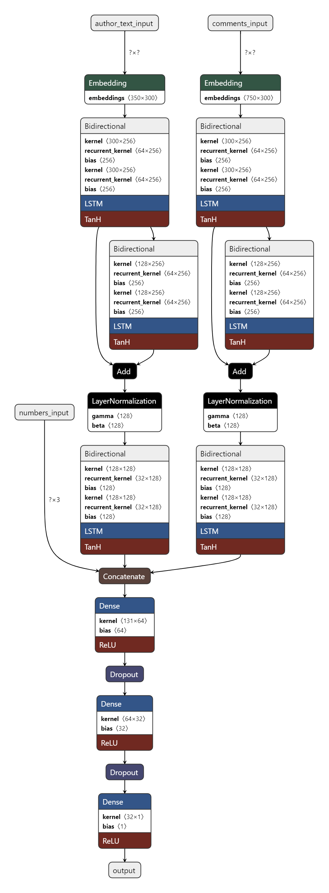

# Predicting the Number of Dislikes on YouTube Videos. Part 2 — Model
## How to (try to) build a deep neural network to predict count of dislikes using Tensorflow/Keras

|  |
|:--:|
| <b>Preview. Image by Author</b>|

In this article, you will learn how to:
- preprocess text data using NLTK;
- use pretrained word embeddings in TensorFlow/Keras Embedding layer;
- use TensorFlow Functional API to build non-sequential neural networks architectures;
- visualize neural network structure using `tensorflow.keras.utils.plot_model()` and [Netron](https://netron.app/).

This is a logical continuation of the following article - [Predicting the Number of Dislikes on YouTube Videos. Part 1 — Dataset](https://towardsdatascience.com/predicting-the-number-of-dislikes-on-youtube-videos-part-1-dataset-9ec431585dc3), where I collected the dataset using YouTube Data API v3.

All the code I used in this article is available in the same [GitLab repository](https://gitlab.com/Winston-90/youtube_dislikes); however, remember that the code from the article and the repository may be slightly different since here I do not use functions for simplification. 

## Disclaimer

To be honest with you and with myself, I must say that I failed to solve this problem successfully. But I think that a bad experience is also an experience, that's why I'm sharing it with you. And in the end, I'll tell you why it happened that way.

## Dataset

I described the process of collecting the dataset in detail in the first part of this project. Now I want to note which fields from it I will use for predictions:
- `video_id` - Unique video ID - NOT used as a feature because it doesn't contain information
- `title` - Video title - used as a feature
- `channel_id` - Channel ID - NOT used as a feature because it doesn't contain information
- `channel_title` - Channel title - used as a feature
- `published_at` - Video publication date - NOT used as a feature because all the videos belong to the same time period (2021)
- `view_count` - Number of views - used as a feature
- `likes` - Number  of likes - used as a feature
- `dislikes` - Number  of dislikes - used as a target label 
- `comment_count` - Number of comments - used as a feature
- `tags` - Video tags as one string - used as a feature
- `description` - Video description - used as a feature
- `comments` - 20 video comments as one string - used as a feature

As a result, we are facing a regression task, with 3 numeric input features (`view_count`, `likes`, and `comment_count`) and 5 text input features (`title`, `channel_title`, `tags`, `description`, and `comments`).

## Data Preparation 

Among all the videos from the dataset (37k), I decided to start with those that were popular in the USA - this is about 16k rows. 

Since numeric features don't need to be prepared, all we need to do is slice needed columns and convert them into a numpy array. The code is very simple:

```python
numeric_data = df[['view_count', 'likes', 'comment_count']].to_numpy()
numeric_data.shape  # (15818, 3)
```

### Clean Text Data

For text data, everything is more complicated. First of all, I created a new `author_text` feature that contains all text information provided by the author. It consists of a concatenation of the following features: `title`, `channel_title`, `tags`, and `description`. This way we will reduce the number of text features from five to two, which will greatly reduce the number of model parameters later.

```python
# create one column that contains all author text 
df['author_text'] = df[['title', 'channel_title',
                        'tags', 'description']].agg(' '.join, axis=1)
```

But before that, we need to do at least a little data cleaning. I decided to remove punctuation from `title`, `channel_title` and `tags`, and remove nonsense words from `description` and `comments` columns.

I did this using the [NLTK library](https://www.nltk.org/). To run the code below for the first time, you will have to download some NLTK data - keep this in mind by running `ntlk.download('something')` command.

We will clean the data using the [pandas apply function](https://pandas.pydata.org/docs/reference/api/pandas.DataFrame.apply.html), which allows us to apply some function for each row of the dataset. It remains only to write the function which will return a clean version of its input.

In case of removing nonsense, let's keep only those words that are contained in `nltk.corpus.words.words()`. This set contains 235 thousand English words - feel free to copy and explore the code below. 

```python
import nltk
import random

# to use nltk.corpus.words.words()
nltk.download('words')

words = set(nltk.corpus.words.words())

len(words)  # 235k

random.sample(words, 5)  # 5 random elements from set

'python' in words  # True - this set contains 'python' word
 
'nonpython' in words  # False - this set doesn't contain 'nonpython' word
```

|  |
|:--:|
| <b>Result of executing the code above. Image by Author</b>|

`remove_nonsence()` function joins all words that are present in this set. It receives an input sentence (an element of the current row) and returns its clean version. It will be applied to all rows of a certain column.

```python
import nltk

# to use nltk.corpus.words.words()
nltk.download('words')
# to use nltk.tokenize.word_tokenize(string)
nltk.download('punkt')

# 235 thousand words that we will consider as words that have some meaning
words = set(nltk.corpus.words.words())

def remove_nonsence(sentence):
    """ Delete all words that are not contained in the 'words' set """

    return " ".join(w.lower() for w in nltk.tokenize.word_tokenize(sentence)
                    if w.lower() in words)

for column in ['description', 'comments']:
    # apply remove_nonsence() function for every row in the pd.Series
    df[column] = df[column].apply(remove_nonsence)
```

Note, that `nltk.tokenize.word_tokenize(sentence)` turns a `sentence` string into an array of words, where each element is a word or a punctuation mark.

|  |
|:--:|
| <b>Result of executing `nltk.tokenize.word_tokenize()` function. Image by Author</b>|

When we are removing punctuation, we should keep only those words that contain only numbers and letters. This will also remove words that contain special characters in the middle of the word (for example "c@t") but such words will be ignored later at the embeddings stage, so this is not a big problem.

```python
import nltk

# to use nltk.tokenize.word_tokenize(string)
nltk.download('punkt')

def remove_punctuation(sentence):
    """ Delete punctuation from sentence and convert words to lowercase """

    # string.isalnum() returns True if all the characters are alphanumeric, 
    # meaning alphabet letter (a-z) and numbers (0-9).
    return " ".join(w.lower() for w in nltk.tokenize.word_tokenize(sentence)
                    if w.isalnum())

# delete punctuation from 'title', 'channel_title' and 'tags'
for column in ['title', 'channel_title', 'tags']:
    df[column] = df[column].apply(remove_punctuation)
```

## Convert Text to Vectors Using Pretrained Word Embeddings

Now we need to convert the text into numbers that are understandable to the computer and our model. Two of the most important parameters here are:
- `max_tokens` - thr size of the vocabulary. The `TextVectorization` layer will consider only the `max_tokens` top popular words;
- `sentence_length` - the maximum number of words in a sentence. Longer sentences will be truncated, shorter ones will be pad with the special `<pad>` symbol.

If `max_tokens` parameter does not greatly affect performance and usually equals a large number (10k, 20k, so on), `sentence_length` affects it very much. Later we will see that this value is present as one of the dimensions of the matrix - if it is too large, the matrix will be huge, but sparse, and if it is very small, we risk losing a lot of information.

A good way to choose this parameter is to build a histogram - a histogram of the number of words in sentences and calculate some quantiles. After that, you can choose a value that covers 80% or 95% of the dataset.

|  |
|:--:|
| <b>Histograms of the number of words in sentences for comments and author_text. Image by Author</b>|

You can see the code that creates these histograms below (this is a part of `data_transformations.ipynb` notebook):

```python
import numpy as np
import matplotlib.pyplot as plt 
import seaborn as sns
sns.set()

# X variable contains pandas.DataFrame
comments_lenght = X['comments'].str.split().apply(len).to_numpy()
author_lenght = X['author_text'].str.split().apply(len).to_numpy()

fig, (ax1, ax2) = plt.subplots(1, 2, figsize=(16, 6))
fig.suptitle('Select good sentence_length')

ax1.hist(comments_lenght, 30, density=True)
ax1.set_xlabel("Number of words")
ax1.set_ylabel("Frequency")
ax1.set_title("Histogram of the sentence_length for `comments` column\n" +
              "0.80 quantile = {:.1f}, ".format(np.quantile(comments_lenght, 0.8)) +
              "0.95 quantile = {:.1f}".format(np.quantile(comments_lenght, 0.95)))

ax2.hist(author_lenght, 30, density=True)
ax2.set_xlabel("Number of words")
ax2.set_ylabel("Frequency")
ax2.set_title("Histogram of the sentence_length for `author_text` column\n" +
              "0.80 quantile = {:.1f}, ".format(np.quantile(author_lenght, 0.8)) +
              "0.95 quantile = {:.1f}".format(np.quantile(author_lenght, 0.95)))
```

Let the sentence be a unit of the text dataset. For example, you will get a sentence by executing `df['comments'][0]` command.

Initially, we are dealing with a tensor of size `(n, ?)` (where `n` is the size of the dataset), because all sentences have different lengths. We have to convert these sentences into arrays of words with fixed lengths. After tokenization (what we saw above with `nltk.tokenize.word_tokenize(sentence)`) arrays shorter than `sentence_length` are padded with a special padding symbol, and arrays longer than `sentence_length` are truncated. Now we are working with a tensor of size `(n, sentence_length)`.

After that, we need to assign a vector to each word in the sentence - that is embeddings. If you do not use pretrained word embeddings, then these vectors will be learned by the network during the learning process, as well as other parameters. But getting representative word embedding is a quite difficult task that requires a huge amount of data and computational power. Assigning each word a vector of length `emb_dim` (dimension of embeddings) we will get a resulting tensor of size `(n, sentence_length, emb_dim)`.

The process that I have described here is formalized in the [`pretrained_word_embeddings.ipynb` notebook](https://gitlab.com/Winston-90/youtube_dislikes/-/blob/main/pretrained_word_embeddings.ipynb). Based on this code, I have composed the following image that will bring more clarity compared to the text.

|  |
|:--:|
| <b>Preprocess text using word embeddings. Image by Author</b>|

This toy dataset contains 8 unique words: "I", "like", "cats", "and", "dogs", "apdnv", "is", "something". All these words are present in the vocabulary learned from the dataset since 8+2 ≤ `max_tokens` (set to 10). Meanwhile, the first element of the vocabulary (`''`) is the `<pad>` symbol, and the second (`'[UNK]'`)- a special symbol for unknown words (it will be used if we set `max_tokens` < 10 for this case). These two symbols are always present in the vocabulary.

Note that the word embedding for words "I", "like", and "cats" are similar for the first and second sentences and also match the corresponding lines in the `embeddings\glove.6B\glove.6B.50d.txt` file. Also, the word "apdnv" was embedded into a zero vector because the embedding dictionary doesn't contain this word.

|  |
|:--:|
| <b>Making sure that embeddings match. Image by Author</b>|

You can download free pretrained word embeddings for more than 40 languages from the link below.

http://vectors.nlpl.eu/repository/

## Building Model

Finally, we can go to the network. Why neural network?

The main information in this task is carried by text features - they have the most predictive power. Time has shown that classical machine learning algorithms cope with text processing much worse than neural networks do. We are talking about NLP - *Natural Language Processing*. This area includes a huge variety of tasks - from *Named-Entity Recognition* and *Parts-of-Speech Tagging* to *Text Summarization* and *Machine Translation*. The current task is most similar to Sentiment Analysis - predicting the "mood" of the text.

### Neural Network Architecture

Let's move on to the most interesting - building the architecture of the model.

Let me describe the main heuristics that I used when building the architecture of the model:
1. To convert text into vectors, we will use **pretrained word embeddings**;
2. Since the task is not strictly sequential, and the whole text is visible to the model, I suggest using **bi-directional LSTM** instead of one-directional;
3. To extract more information from the text, we will use a **multi-layer LSTM**. At the same time, we will use **skip connections** to simplify the learning process;
4. For comments and the author's data, we will make similar layers but with different weights, since the opinion of the author/viewers may vary greatly;
5. Numerical parameters of the model will not be passed through a deep network, to not complicate the structure;
6. After extracting the features from the text, we will combine all the available information and send it to the input of a little feed-forward neural network.

You can see the network structure and the detailed code generating it below (a part of `model.ipynb` notebook).

|  |
|:--:|
| <b>Neural network architecture. Image by Author</b>|

```python
def LSTM_and_skip_connection(inputs):
    """ 
    Network block with 64-unit LSTM, skip connection and layer normalization.
    Inputs and outputs tensor of shape (None, None, 128)
    """
    
    text_features = layers.Bidirectional(
            layers.LSTM(64, return_sequences=True))(inputs)
    text_features = layers.Add()([text_features, inputs])
    output = layers.LayerNormalization()(text_features)
    
    return output

# variable-length input for author_text
text_1_input = keras.Input(shape=(None,), name="author_text_input")

# variable-length input for comments
text_2_input = keras.Input(shape=(None,), name="comments_input")

# 3 vectors of numbers
numbers_input = keras.Input(shape=(3,), name="numbers_input")

# using pretrained embeddings
text_1_features = embeddings_1(text_1_input)
text_2_features = embeddings_2(text_2_input)

# processing author_text
text_1_features_1 = layers.Bidirectional(
    layers.LSTM(64, return_sequences=True))(text_1_features)
text_1_features = LSTM_and_skip_connection(text_1_features_1)
text_1_features = layers.Bidirectional(layers.LSTM(32))(text_1_features)

# processing comments
text_2_features_1 = layers.Bidirectional(
    layers.LSTM(64, return_sequences=True))(text_2_features)
text_2_features = LSTM_and_skip_connection(text_2_features_1)
text_2_features = layers.Bidirectional(layers.LSTM(32))(text_2_features)

# merge all available features into a single large vector
concat = layers.concatenate(
    [text_1_features, text_2_features, numbers_input], name='concat')

# final part of the model
dense_1 = layers.Dense(64, activation='relu',
                        name='dense_64')(concat)
dropout_1 = layers.Dropout(0.2, name='dropout_1')(dense_1)
dense_2 = layers.Dense(32, activation='relu',
                        name='dense_32')(dropout_1)
dropout_2 = layers.Dropout(0.2, name='dropout_2')(dense_2)
output = layers.Dense(1, activation='relu', name='output')(dropout_2)

model = keras.Model(inputs=[text_1_input, text_2_input, numbers_input],
                    outputs=output)
```

### Visualize Neural Network Architecture

Below you can see the output of `tensorflow.keras.utils.plot_model()` function that draws the network structure. 

|  |
|:--:|
| <b>Neural network architecture - output of the `plot_model()` function. Image by Author</b>|

To use this function in your project, do the following:
1. Make sure you use TensorFlow version 2.7 or higher (you can do this by printing `tf.__version__`), because this feature is only available in later versions of the package. If you are using an earlier version of TensorFlow, update the package (`pip install --upgrade tensorflow`).
2. You need to install pydot and Graphviz to execute this function. For pydot run `pip install pydot`, and for Graphviz follow the [official documentation](https://graphviz.org/download/).

You can also use [Netron](https://netron.app/). This method copes worse with large networks and is less convenient while working with the network architecture, since you need to save the network and open it using the application, but it creates really beautiful visualizations and allows you to explore networks in detail or even download the weights of certain layers. Definitely try it!

|  |
|:--:|
| <b>Neural network architecture - visualization by [Netron](https://netron.app/). Image by Author</b>|

## Conclusions, and What Can Be Done Better

You've seen the disclaimer at the top, and you already know that I failed. Well, although I hoped and tried to the last, it's time to accept it. The best quality I got is about a **6k validation error (MAE)**. It's not as bad as it could be, but it's not good at all.

What can be done better? Yes, in fact, almost everything, because the task is still not solved. But let me share certain thoughts about what could improve the quality of the model:
1. Using more powerful word embeddings - for example, BERT instead of GloVe;
2. Using the attention mechanism instead of bidirectional LSTM;
3. Using a more powerful model - more LSTM_and_skip_connection blocks, transformer-like architecture, etc.

It looks a little strange, doesn't it? Here I am listing particular guesses that can solve the problem, so why didn't I do it? Why didn't I try all this and tell you about the results?

Well, actually I tried. Initially, I used 50-dim GloVe embeddings but also tried fastText and ELMo. I tried more blocks, more layers, more training epochs. I removed the features (tried without `author_text` or without `comments`), changed the data preprocessing and preparation, and nothing helps. But at the same time, I am sure that the architecture and embeddings work pretty well (for example, it was able to solve the classification problem successfully using [this sentiment analysis dataset](https://www.kaggle.com/kritanjalijain/amazon-reviews)).

There is a popular principle in machine learning (another variation of **Garbage In - Garbage Out**):

If a domain expert cannot draw a conclusion from the data, the machine learning model most likely will not be able to do it either.

Of course, I'm not an expert, but the comment data is so noisy and uncertain that I can't approximately predict the number of dislikes or even say whether users liked a particular video or not!

*The data is unrepresentative - this is the main problem*. And it's not because I collected them incorrectly, but this might be my fault too. Maybe, using one or two of the most popular comments is a better choice than 20, and it would raise the quality. But anyway, to train a good network, you need to spend a lot of resources primarily on data collection. And unfortunately, I don't have such resources.

A negative experience is also an experience. Moreover, it is a more useful experience than a positive one. That's why I'm sharing it with you. This project has taught me a lot. I hope it will be useful to you too, at least a little.

### References

https://keras.io/examples/nlp/pretrained_word_embeddings/
